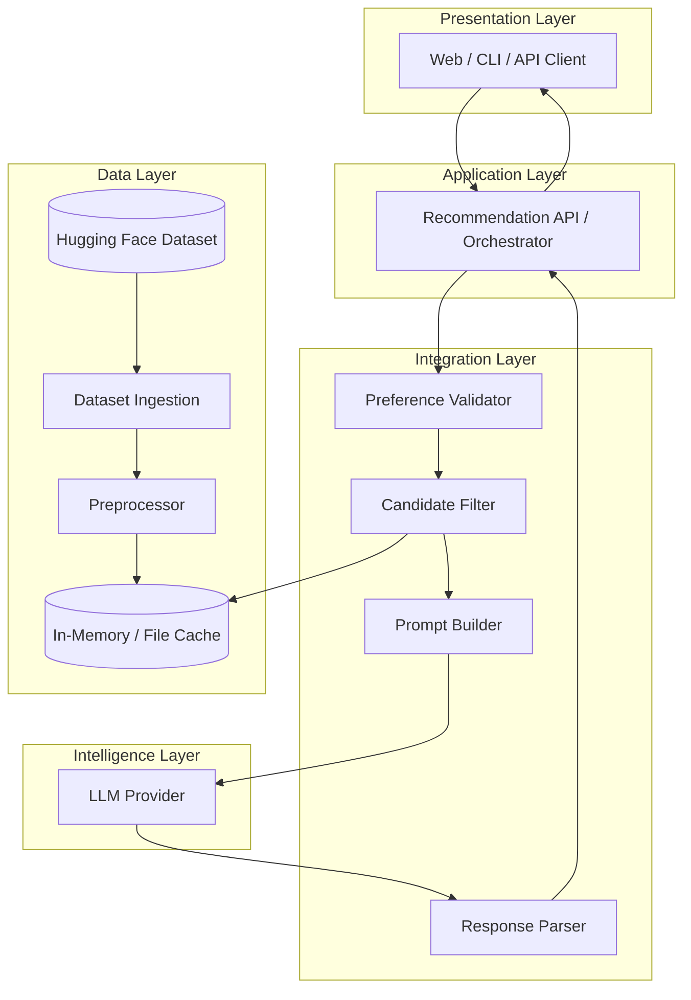
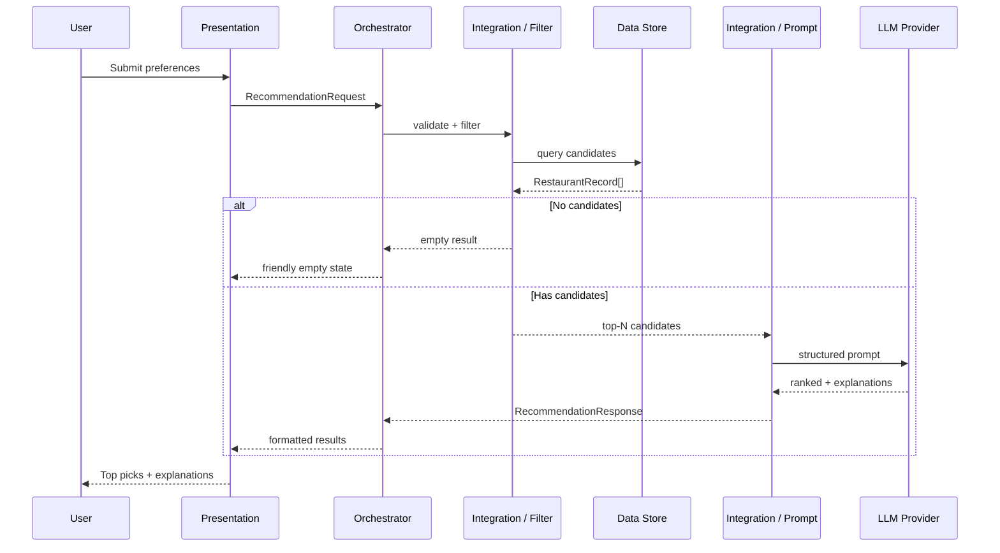
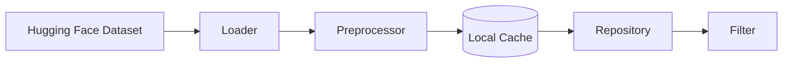
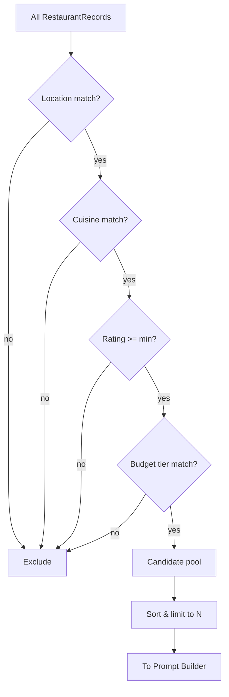
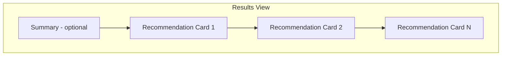
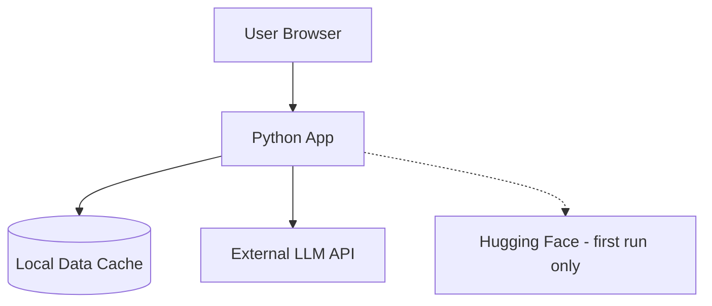

# System Architecture: AI-Powered Restaurant Recommendation System

This document describes the technical architecture for the Zomato-inspired restaurant recommendation service. It expands on [context.md](./context.md) with component boundaries, data flows, interfaces, and implementation guidance.

---

## 1. Purpose and Scope

### 1.1 Business Goal

Deliver personalized restaurant recommendations by combining:

- **Deterministic filtering** over a real Zomato-style dataset (structured, auditable).
- **Generative reasoning** via an LLM (ranking, explanations, optional summary).

### 1.2 Architectural Principles

| Principle | Rationale |
|-----------|-----------|
| **Filter before generate** | Reduce LLM token cost and hallucination risk by sending only relevant candidates. |
| **Structured in, structured out** | User prefs and restaurant records are typed; LLM output is parsed into a schema. |
| **Separation of concerns** | Data, filtering, prompting, and UI are independent modules. |
| **Fail gracefully** | Empty filter results and LLM errors surface clear messages, not silent failures. |
| **Observable pipeline** | Log filter counts, prompt size, and latency at each stage. |

### 1.3 In Scope

- Hugging Face dataset ingestion and preprocessing
- Preference collection and validation
- Candidate filtering and prompt construction
- LLM-based ranking and explanation
- User-facing presentation of top recommendations

### 1.4 Out of Scope (v1)

Per [context.md](./context.md): user accounts, authentication, payment, booking, and real-time Zomato API integration.

---

## 2. High-Level Architecture

### 2.1 Logical View (Five Layers)



### 2.2 End-to-End Request Flow



### 2.3 Pipeline Summary

```
User Preferences
    → Validate & normalize
    → Filter dataset (deterministic)
    → Build LLM prompt (structured JSON/text)
    → LLM rank + explain (+ optional summary)
    → Parse & validate LLM output
    → Merge with source records
    → Render UI
```

---

## 3. Component Architecture

### 3.1 Data Layer

**Responsibility:** Load, clean, normalize, and serve restaurant records.

| Component | Role |
|-----------|------|
| **Dataset Loader** | Fetch `ManikaSaini/zomato-restaurant-recommendation` from Hugging Face (`datasets` library or HTTP). |
| **Preprocessor** | Map raw columns to canonical schema; handle nulls, type coercion, text normalization. |
| **Repository / Store** | Expose read-only queries: by location, cuisine, rating range, cost band. |

**Suggested canonical schema (`RestaurantRecord`):**

```text
RestaurantRecord
├── id: string
├── name: string
├── location: string          # city / area
├── cuisines: string[]        # split multi-value cuisine field
├── rating: float             # e.g. 0–5
├── cost_for_two: int?        # INR or normalized tier
├── cost_tier: enum           # low | medium | high (derived)
├── address: string?
├── votes: int?
└── raw: dict                 # optional passthrough for debugging
```

**Preprocessing rules:**

- **Location:** Normalize casing; alias common variants (e.g. `Bengaluru` → `Bangalore` if needed).
- **Cuisine:** Lowercase, trim; split on `,` / `|` delimiters.
- **Rating:** Parse to float; drop or flag invalid rows.
- **Cost:** Map numeric `cost_for_two` to `cost_tier` using configurable thresholds (e.g. &lt;500 low, 500–1000 medium, &gt;1000 high).
- **Caching:** After first load, persist parquet/JSON locally to avoid repeated HF downloads.

**Data layer diagram:**



---

### 3.2 Input Layer (User Preferences)

**Responsibility:** Collect, validate, and normalize user input before filtering.

**Preference model (`UserPreferences`):**

```text
UserPreferences
├── location: string          # required
├── budget: enum              # low | medium | high
├── cuisine: string?          # optional primary cuisine
├── min_rating: float?        # e.g. 3.5
├── additional: string[]?     # e.g. family-friendly, quick service
└── max_results: int?         # default e.g. 5
```

| Field | Validation |
|-------|------------|
| `location` | Non-empty; must match known cities in dataset or fuzzy match with warning |
| `budget` | One of `low`, `medium`, `high` |
| `cuisine` | Optional; normalized string |
| `min_rating` | 0–5 if provided |
| `additional` | Free-text tags passed to LLM context (not always filterable in v1) |

**Input channels (choose one or more for implementation):**

- Web form (Streamlit, React, etc.)
- CLI questionnaire
- REST `POST /recommendations` with JSON body

---

### 3.3 Integration Layer

The integration layer bridges structured data and the LLM. It has three sub-components.

#### 3.3.1 Candidate Filter

**Responsibility:** Deterministically narrow the dataset.

| Filter | Logic |
|--------|--------|
| Location | Exact or case-insensitive match on `location` |
| Cuisine | Substring or set intersection on `cuisines` |
| Min rating | `rating >= min_rating` |
| Budget | `cost_tier == budget` (derived at preprocess time) |

**Post-filter steps:**

1. Sort by rating (desc), then votes (desc) as tiebreaker.
2. Cap candidates sent to LLM (e.g. **top 20–50**) to control tokens and latency.
3. If count is **0**, short-circuit: return empty state without LLM call.



#### 3.3.2 Prompt Builder

**Responsibility:** Assemble a consistent, reproducible prompt.

**Prompt structure (recommended):**

1. **System message:** Role (restaurant expert), constraints (only recommend from provided list, no invented restaurants), output format (JSON schema).
2. **User message:**
   - Serialized `UserPreferences`
   - Numbered list of candidates (id, name, location, cuisines, rating, cost)
   - Task: rank top K, explain each, optional one-paragraph summary

**Design guidelines:**

- Include **restaurant IDs** so the parser can join LLM output back to records.
- Ask for **JSON-only** response to simplify parsing.
- Specify **max recommendations** (e.g. 5) aligned with UI.

**Example output schema (LLM contract):**

```json
{
  "summary": "Optional overview for the user.",
  "recommendations": [
    {
      "restaurant_id": "string",
      "rank": 1,
      "explanation": "Why this fits the user's preferences."
    }
  ]
}
```

#### 3.3.3 Response Parser

**Responsibility:** Validate LLM output and merge with source data.

| Step | Action |
|------|--------|
| Parse | JSON parse with fallback retry or regex extraction |
| Validate | Every `restaurant_id` exists in candidate set |
| Enrich | Attach `name`, `cuisine`, `rating`, `estimated_cost` from `RestaurantRecord` |
| Order | Sort by `rank` |
| Fallback | On parse failure: return deterministic top-K by rating with generic explanation |

---

### 3.4 Intelligence Layer (Recommendation Engine)

**Responsibility:** LLM invocation for ranking, explanation, and optional summary.

| Concern | Approach |
|---------|----------|
| **Provider** | Groq, OpenAI, Azure OpenAI, Anthropic, or local model (Ollama) — abstract behind `LLMClient` interface |
| **Parameters** | Low temperature (0.2–0.5) for stable ranking; max tokens sized to candidate count |
| **Retries** | Exponential backoff on rate limits; max 2 retries |
| **Timeout** | Configurable (e.g. 30s); fail with user-visible message |
| **Cost control** | Hard cap on candidates in prompt; optional response caching keyed by preference hash |

**LLM responsibilities (from requirements):**

- Rank restaurants relative to stated preferences
- Generate per-restaurant explanations
- Optionally produce a short summary of the overall selection

**Non-responsibilities:**

- Inventing restaurants not in the candidate list
- Replacing hard filters (location, min rating) — those stay in the filter stage

---

### 3.5 Presentation Layer

**Responsibility:** Display results in a user-friendly format.

**Per recommendation card / row:**

| Field | Source |
|-------|--------|
| Restaurant name | `RestaurantRecord.name` |
| Cuisine | `RestaurantRecord.cuisines` (joined display) |
| Rating | `RestaurantRecord.rating` |
| Estimated cost | `cost_for_two` or budget tier label |
| AI explanation | LLM `explanation` |

**Optional UI elements:**

- Summary paragraph from LLM
- Empty state when filters return no rows
- Loading state during dataset load and LLM call
- Error banner for LLM/parse failures with retry



---

## 4. Application Orchestration

A single **Recommendation Orchestrator** coordinates the pipeline:

```text
recommend(preferences: UserPreferences) -> RecommendationResult

1. validate(preferences)
2. candidates = filter(store, preferences)
3. if candidates.is_empty(): return EmptyResult
4. prompt = build_prompt(preferences, candidates)
5. raw = llm_client.complete(prompt)
6. parsed = parse_response(raw, candidates)
7. return enrich(parsed, candidates)
```

This function is the only entry point the presentation layer needs, whether exposed via CLI, Streamlit, or FastAPI.

---

## 5. Deployment Views

### 5.1 Monolith (Recommended for v1)

Single Python process:

- Loads dataset on startup (or lazy on first request)
- Streamlit or FastAPI + simple HTML frontend
- Environment variable for LLM API key



### 5.2 Split Services (Future)

| Service | Responsibility |
|---------|----------------|
| **Data service** | Ingestion, preprocessing, search/filter API |
| **Recommendation service** | Prompt + LLM + parse |
| **BFF / Gateway** | Auth, rate limiting, aggregation |

Use when scale, team boundaries, or independent scaling of LLM calls is required.

---

## 6. Interface Definitions (Conceptual)

### 6.1 REST API (Optional)

```http
POST /api/v1/recommendations
Content-Type: application/json

{
  "location": "Bangalore",
  "budget": "medium",
  "cuisine": "Italian",
  "min_rating": 4.0,
  "additional": ["family-friendly"],
  "max_results": 5
}
```

**Response 200:**

```json
{
  "summary": "string | null",
  "recommendations": [
    {
      "restaurant_id": "string",
      "name": "string",
      "cuisine": "string",
      "rating": 4.2,
      "estimated_cost": "₹800 for two",
      "explanation": "string",
      "rank": 1
    }
  ],
  "meta": {
    "candidates_considered": 12,
    "latency_ms": 2400
  }
}
```

**Response 422:** Validation errors on preferences.  
**Response 404 / 200 empty:** No restaurants match filters.

### 6.2 Internal Module Contracts

| From | To | Contract |
|------|-----|----------|
| Presentation | Orchestrator | `UserPreferences` |
| Orchestrator | Repository | `FilterQuery` → `RestaurantRecord[]` |
| Orchestrator | Prompt Builder | `(UserPreferences, RestaurantRecord[])` → `Prompt` |
| Orchestrator | LLM Client | `Prompt` → `string` |
| Orchestrator | Parser | `(string, RestaurantRecord[])` → `RecommendationResponse` |

---

## 7. Cross-Cutting Concerns

### 7.1 Configuration

| Key | Description |
|-----|-------------|
| `HF_DATASET_NAME` | `ManikaSaini/zomato-restaurant-recommendation` |
| `LLM_MODEL` | Model identifier |
| `LLM_API_KEY` | Secret via env, never committed |
| `MAX_CANDIDATES_FOR_LLM` | Default 30 |
| `MAX_RESULTS` | Default 5 |
| `COST_TIER_THRESHOLDS` | low/medium/high boundaries |

### 7.2 Error Handling

| Scenario | Behavior |
|----------|----------|
| HF download fails | Retry; show cached copy if available |
| Zero filter matches | UI message: broaden location/cuisine/budget |
| LLM timeout | Retry once; then deterministic fallback ranking |
| Invalid LLM JSON | Retry with stricter prompt; else fallback |
| Unknown `restaurant_id` in LLM output | Drop entry; log warning |

### 7.3 Logging and Metrics

- `dataset.load.duration`, `dataset.record_count`
- `filter.input_count`, `filter.output_count`
- `llm.prompt_tokens`, `llm.latency`, `llm.success`
- `recommendation.request_id` for traceability

### 7.4 Security and Privacy

- No PII required in v1; preferences are session-scoped
- API keys in environment variables only
- Sanitize `additional` free text before logging (optional redaction)
- Rate-limit public API if deployed

---

## 8. Suggested Technology Stack

Not mandated by the problem statement; reasonable defaults:

| Layer | Option A (rapid prototype) | Option B (production-oriented) |
|-------|---------------------------|--------------------------------|
| Language | Python 3.11+ | Python 3.11+ |
| Data | `datasets`, `pandas` | Same + Parquet cache |
| API / UI | Streamlit | FastAPI + React |
| LLM | Groq (e.g., Llama 3.1) | Azure OpenAI with private endpoint |
| Config | `pydantic-settings` | Same |
| Tests | `pytest` for filter + parser | + contract tests for prompt schema |

---

## 9. Directory Layout (Reference)

Suggested repository structure when implementation begins:

```text
project/
├── docs/
│   ├── context.md
│   ├── architecture.md
│   └── Problem statement.txt
├── src/
│   ├── data/
│   │   ├── loader.py
│   │   ├── preprocessor.py
│   │   └── repository.py
│   ├── models/
│   │   ├── preferences.py
│   │   └── restaurant.py
│   ├── integration/
│   │   ├── filter.py
│   │   ├── prompt_builder.py
│   │   └── response_parser.py
│   ├── llm/
│   │   └── client.py
│   ├── orchestrator.py
│   └── api/ or app/
│       └── main.py
├── tests/
├── config/
└── requirements.txt
```

---

## 10. Requirements Traceability

| Requirement ([context.md](./context.md)) | Architectural element |
|------------------------------------------|------------------------|
| Hugging Face Zomato dataset | Data Layer: Loader + Preprocessor |
| User preferences | Input Layer: `UserPreferences` + Validator |
| Filter before LLM | Integration Layer: Candidate Filter |
| Prompt for reasoning/ranking | Integration Layer: Prompt Builder |
| LLM rank + explain + summary | Intelligence Layer: LLM Client + schema |
| Display name, cuisine, rating, cost, explanation | Presentation Layer + Parser enrich step |

---

## 11. Evolution Roadmap

| Phase | Enhancement |
|-------|-------------|
| v1 | Monolith, filter + LLM, basic UI |
| v1.1 | Local dataset cache, structured JSON output enforcement |
| v2 | Semantic search (embeddings) for `additional` preferences |
| v2.1 | User accounts, saved preferences, history |
| v3 | Split data/recommendation services, caching, A/B prompt variants |

---

## 12. References

- Project context: [docs/context.md](./context.md)
- Problem statement: [docs/Problem statement.txt](./Problem%20statement.txt)
- Dataset: https://huggingface.co/datasets/ManikaSaini/zomato-restaurant-recommendation
