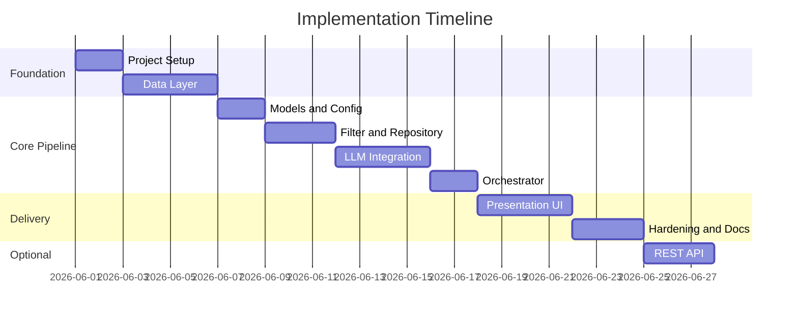

# Phase-Wise Implementation Plan

AI-Powered Restaurant Recommendation System (Zomato Use Case)

This plan translates [context.md](./context.md) and [architecture.md](./architecture.md) into ordered phases with tasks, deliverables, acceptance criteria, and dependencies. Follow phases sequentially; later phases assume earlier deliverables are complete.

---

## Plan Overview

| Phase | Name                  | Primary layer              | Outcome                                          |
| ----- | --------------------- | -------------------------- | ------------------------------------------------ |
| 0     | Project setup         | —                          | Runnable repo, tooling, env template             |
| 1     | Data ingestion        | Data                       | Clean `RestaurantRecord` dataset in memory/cache |
| 2     | Models and config     | Cross-cutting              | Typed prefs, settings, directory layout          |
| 3     | Filter and repository | Integration (partial)      | Deterministic candidate shortlist                |
| 4     | LLM integration       | Integration + Intelligence | Ranked JSON + explanations from LLM              |
| 5     | Orchestrator          | Application                | Single `recommend()` entry point                 |
| 6     | Presentation UI       | Presentation               | End-user flow with all required fields           |
| 7     | Hardening and docs    | Cross-cutting              | Tests, logging, README, demo-ready               |
| 8     | REST API (optional)   | Presentation + API         | `POST /recommendations` contract                 |

**Estimated total (Phases 0–7):** ~24 working days for one developer (adjust for team size).

---

## Requirements Traceability

Track completion against [context.md](./context.md) checklist:

| #   | Requirement                                                  | Completed in phase |
| --- | ------------------------------------------------------------ | ------------------ |
| R1  | Hugging Face dataset loaded and preprocessed                 | Phase 1            |
| R2  | User specifies location, budget, cuisine, min rating, extras | Phase 2, 6         |
| R3  | Filtering narrows candidates before LLM                      | Phase 3            |
| R4  | Prompt supports reasoning and ranking                        | Phase 4            |
| R5  | LLM returns ranked recommendations with explanations         | Phase 4            |
| R6  | UI shows name, cuisine, rating, cost, AI explanation         | Phase 6            |

---

## Phase 0: Project Setup

**Goal:** Establish repository structure, dependencies, and development workflow before feature code.

### Tasks

| ID  | Task                     | Details                                                                                                                        |
| --- | ------------------------ | ------------------------------------------------------------------------------------------------------------------------------ |
| 0.1 | Initialize `src/` layout | Match [architecture.md §9](./architecture.md): `data/`, `models/`, `integration/`, `llm/`, `orchestrator.py`, `app/`           |
| 0.2 | Add `requirements.txt`   | `datasets`, `pandas`, `pydantic`, `pydantic-settings`, `python-dotenv`; add `streamlit` or `fastapi` + `uvicorn` per UI choice |
| 0.3 | Add `.env.example`       | `LLM_API_KEY`, `LLM_MODEL`, `HF_DATASET_NAME`, `MAX_CANDIDATES_FOR_LLM`, `MAX_RESULTS`                                         |
| 0.4 | Update `.gitignore`      | `.env`, `data/cache/`, `__pycache__/`, `.venv/`                                                                                |
| 0.5 | Configure `pytest`       | `tests/` directory, `conftest.py` with sample fixtures stub                                                                    |
| 0.6 | Update root `README.md`  | Link to `docs/context.md`, `architecture.md`, this plan; setup and run instructions placeholder                                |

### Deliverables

- Empty module tree with `__init__.py` files
- Installable environment (`pip install -r requirements.txt`)
- Documented env variables

### Acceptance criteria

- [ ] `python -m pytest` runs (0 tests OK)
- [ ] No secrets in repository
- [ ] README lists docs and high-level run command (to be filled in Phase 7)

### Dependencies

- None

**Duration:** 1–2 days

---

## Phase 1: Data Layer

**Goal:** Load Hugging Face Zomato data, preprocess to canonical schema, persist cache, expose repository queries. Satisfies **R1**.

**Architecture reference:** [§3.1 Data Layer](./architecture.md), [context § Data Ingestion](./context.md)

### Tasks

| ID  | Task                        | Details                                                                                                                |
| --- | --------------------------- | ---------------------------------------------------------------------------------------------------------------------- |
| 1.1 | Implement `loader.py`       | `load_dataset("ManikaSaini/zomato-restaurant-recommendation")` via `datasets`; handle download errors with retry       |
| 1.2 | Inspect raw schema          | Log column names; map to internal fields (document mapping in code comments or `docs/data-schema.md`)                  |
| 1.3 | Implement `preprocessor.py` | Normalize location, split cuisines, parse rating, derive `cost_tier` from `cost_for_two` using configurable thresholds |
| 1.4 | Assign stable `id`          | Hash of name+location or dataset index as string                                                                       |
| 1.5 | Implement local cache       | Save preprocessed DataFrame to `data/cache/restaurants.parquet` (or JSON); skip HF if cache exists and not stale       |
| 1.6 | Implement `repository.py`   | `get_all()`, `get_locations()` (unique cities), `get_by_filters()` stub for Phase 3                                    |
| 1.7 | Define `RestaurantRecord`   | Pydantic model in `models/restaurant.py` per architecture schema                                                       |
| 1.8 | Smoke script                | CLI or test: print record count, sample row, unique locations count                                                    |

### Deliverables

- `src/data/loader.py`, `preprocessor.py`, `repository.py`
- `src/models/restaurant.py`
- Cached dataset on disk after first run

### Acceptance criteria

- [x] Dataset loads from HF or cache without manual intervention
- [x] Every record has `name`, `location`, `cuisines`, `rating`, `cost_tier` (nullable only where source is null)
- [x] Invalid ratings handled (dropped or flagged per team decision, documented)
- [x] `repository.get_all()` returns list of `RestaurantRecord`
- [x] Unit test: preprocessor transforms a small fixture DataFrame correctly

### Dependencies

- Phase 0

**Duration:** 3–4 days

---

## Phase 2: Models and Configuration

**Goal:** Typed user preferences, validation rules, and centralized settings. Foundation for input and integration layers. Supports **R2** (data model).

**Architecture reference:** [§3.2 Input Layer](./architecture.md), [§7.1 Configuration](./architecture.md)

### Tasks

| ID  | Task                                | Details                                                                                                                       |
| --- | ----------------------------------- | ----------------------------------------------------------------------------------------------------------------------------- |
| 2.1 | Define `UserPreferences`            | `models/preferences.py`: location, budget enum, optional cuisine, min_rating, additional list, max_results                    |
| 2.2 | Define `Budget` enum                | `low`, `medium`, `high`                                                                                                       |
| 2.3 | Implement validator                 | `validate_preferences(prefs, known_locations)` — non-empty location, budget enum, rating 0–5; fuzzy location warning optional |
| 2.4 | Implement `settings.py`             | `pydantic-settings`: all keys from architecture §7.1                                                                          |
| 2.5 | Define `RecommendationResult` types | `RecommendationItem`, `EmptyResult`, `RecommendationResponse` with summary + meta placeholders                                |
| 2.6 | Export public API                   | `src/models/__init__.py` re-exports for clean imports                                                                         |

### Deliverables

- `src/models/preferences.py`, `src/config/settings.py` (or `src/settings.py`)
- Response models for orchestrator output

### Acceptance criteria

- [x] Invalid budget raises validation error
- [x] `max_results` defaults to 5 from settings
- [x] Settings load from `.env` without hardcoded API keys
- [x] Unit tests for valid/invalid preference payloads

### Dependencies

- Phase 1 (`known_locations` from repository)

**Duration:** 2 days

---

## Phase 3: Integration Layer — Candidate Filter

**Goal:** Deterministic filtering and sorting before any LLM call. Satisfies **R3**.

**Architecture reference:** [§3.3.1 Candidate Filter](./architecture.md), filter flowchart

### Tasks

| ID  | Task                         | Details                                                                  |
| --- | ---------------------------- | ------------------------------------------------------------------------ |
| 3.1 | Implement `filter.py`        | `filter_candidates(records, prefs) -> list[RestaurantRecord]`            |
| 3.2 | Location filter              | Case-insensitive match on `location`                                     |
| 3.3 | Cuisine filter               | Optional; match if any cuisine contains preference string (normalized)   |
| 3.4 | Rating filter                | `rating >= min_rating` when provided                                     |
| 3.5 | Budget filter                | `cost_tier == prefs.budget`                                              |
| 3.6 | Post-filter sort             | Rating desc, then `votes` desc if available                              |
| 3.7 | Cap candidates               | Limit to `MAX_CANDIDATES_FOR_LLM` (default 30)                           |
| 3.8 | Wire repository              | `repository.query(preferences)` delegates to filter over in-memory store |
| 3.9 | Empty short-circuit contract | Return empty list; document that orchestrator must not call LLM          |

### Deliverables

- `src/integration/filter.py`
- Repository query method complete

### Acceptance criteria

- [x] Bangalore + medium + Italian + min 4.0 returns only matching rows
- [x] Zero matches returns `[]` without error
- [x] Output size ≤ `MAX_CANDIDATES_FOR_LLM`
- [x] Unit tests: each filter dimension independently; combined filter; empty result
- [x] Log `filter.input_count` and `filter.output_count` (simple `logging` module)

### Dependencies

- Phases 1, 2

**Duration:** 3 days

---

## Phase 4: LLM Integration (Prompt, Client, Parser)

**Goal:** Build prompts, call LLM, parse and enrich responses with fallback. Satisfies **R4** and **R5**.

**Architecture reference:** [§3.3.2 Prompt Builder](./architecture.md), [§3.4 Intelligence Layer](./architecture.md), [§3.3.3 Response Parser](./architecture.md)

### Tasks

| ID  | Task                           | Details                                                                                                        |
| --- | ------------------------------ | -------------------------------------------------------------------------------------------------------------- |
| 4.1 | Define `LLMClient` protocol    | `complete(system: str, user: str) -> str` in `llm/client.py`                                                   |
| 4.2 | Implement Groq adapter         | Env-based API key; temperature 0.2–0.5; timeout 30s; max 2 retries with backoff                                |
| 4.3 | Implement `prompt_builder.py`  | System: expert role, no hallucinated restaurants, JSON-only output; User: prefs + numbered candidates with ids |
| 4.4 | Embed JSON schema in prompt    | `summary`, `recommendations[{restaurant_id, rank, explanation}]`                                               |
| 4.5 | Pass `additional` preferences  | Include in user message for LLM reasoning (not filtered in v1)                                                 |
| 4.6 | Implement `response_parser.py` | Parse JSON; validate ids against candidate set; enrich with record fields; sort by rank                        |
| 4.7 | Implement fallback             | On parse/timeout failure: top-K by rating with generic explanation string                                      |
| 4.8 | Manual integration test        | Script with 5–10 mock candidates (no UI) verifying end-to-end LLM call                                         |

### Deliverables

- `src/integration/prompt_builder.py`, `response_parser.py`
- `src/llm/client.py`

### Acceptance criteria

- [x] LLM response parses into `RecommendationResponse`
- [x] Every returned `restaurant_id` exists in candidate list
- [x] Enriched items include name, cuisine string, rating, estimated cost display
- [x] Optional `summary` populated when model complies
- [x] Fallback path works when LLM returns invalid JSON (simulate in test)
- [x] No restaurant appears in output that was not in candidate list

### Dependencies

- Phases 2, 3
- Valid `LLM_API_KEY` for manual tests

**Duration:** 4 days

---

## Phase 5: Application Orchestrator

**Goal:** Single pipeline function coordinating validate → filter → prompt → LLM → parse → enrich. Satisfies architecture [§4](./architecture.md).

### Tasks

| ID  | Task                        | Details                                                                       |
| --- | --------------------------- | ----------------------------------------------------------------------------- |
| 5.1 | Implement `orchestrator.py` | `recommend(prefs: UserPreferences) -> RecommendationResult`                   |
| 5.2 | Startup data load           | `get_repository()` singleton or dependency injection; load/cache on first use |
| 5.3 | Pipeline steps              | Implement 7-step flow from architecture §4 exactly                            |
| 5.4 | Empty result type           | Return structured `EmptyResult` with user-facing message suggestions          |
| 5.5 | Meta block                  | `candidates_considered`, `latency_ms` on success                              |
| 5.6 | CLI entry (optional)        | `python -m src.cli` accepting prefs as args for dev testing                   |

### Deliverables

- `src/orchestrator.py`
- Optional `src/cli.py`

### Acceptance criteria

- [x] One call to `recommend()` runs full pipeline
- [x] Empty filter skips LLM (verify via log or mock)
- [x] End-to-end CLI test: real prefs → printed recommendations
- [x] Errors from validator bubble with clear messages

### Dependencies

- Phases 1–4

**Duration:** 2 days

---

## Phase 6: Presentation Layer (UI)

**Goal:** User-facing app to collect preferences and display results. Satisfies **R2** (collection) and **R6**.

**Architecture reference:** [§3.5 Presentation Layer](./architecture.md), [context § Output Display](./context.md)

### Tasks

| ID  | Task            | Details                                                                                                                          |
| --- | --------------- | -------------------------------------------------------------------------------------------------------------------------------- |
| 6.1 | Choose UI stack | **Recommended v1:** Streamlit for speed; document choice in README                                                               |
| 6.2 | Preference form | Location (dropdown from `repository.get_locations()`), budget select, cuisine text, min rating slider, additional tags text area |
| 6.3 | Submit handler  | Call `recommend()`; show spinner during load + LLM                                                                               |
| 6.4 | Results view    | Card per recommendation: name, cuisine, rating, estimated cost, explanation                                                      |
| 6.5 | Summary block   | Display LLM `summary` when present                                                                                               |
| 6.6 | Empty state     | Message to broaden filters when no matches                                                                                       |
| 6.7 | Error state     | LLM failure message + retry button                                                                                               |
| 6.8 | Session UX      | Clear previous results on new search; basic layout and titles                                                                    |

### Deliverables

- `src/app/main.py` (Streamlit) or equivalent
- Runnable command documented in README

### Acceptance criteria

- [x] User can complete flow without using CLI
- [x] All five required output fields visible per recommendation
- [x] Loading indicator during dataset first load and LLM call
- [x] Empty and error states are user-friendly (not stack traces)
- [x] Demo scenario documented: e.g. Bangalore, medium, North Indian, rating ≥ 4

### Dependencies

- Phase 5

**Duration:** 3–4 days

---

## Phase 7: Hardening, Testing, and Documentation

**Goal:** Production-quality basics for demo and handoff—tests, logging, README, requirement checklist closed.

**Architecture reference:** [§7 Cross-Cutting Concerns](./architecture.md)

### Tasks

| ID  | Task                            | Details                                                                          |
| --- | ------------------------------- | -------------------------------------------------------------------------------- |
| 7.1 | Unit test suite                 | Filter (edge cases), preprocessor, parser (valid/invalid JSON), validator        |
| 7.2 | Integration test                | Mock `LLMClient` returning fixed JSON; assert orchestrator output shape          |
| 7.3 | Structured logging              | Dataset load duration, filter counts, LLM latency, request correlation id (uuid) |
| 7.4 | Error handling pass             | HF retry, LLM timeout, unknown id drop — align with architecture §7.2            |
| 7.5 | Finalize README                 | Prerequisites, `.env` setup, install, run UI, run tests, architecture links      |
| 7.6 | Update context checklist        | Mark R1–R6 complete in `docs/context.md` or copy checklist to README             |
| 7.7 | Demo script                     | 2–3 example preference sets with expected behavior described                     |
| 7.8 | Optional: `docs/data-schema.md` | Raw HF column → `RestaurantRecord` mapping                                       |

### Deliverables

- `tests/` with ≥80% coverage on filter, parser, preprocessor (target)
- README complete
- Logging configured via `logging.basicConfig` or structlog

### Acceptance criteria

- [x] `pytest` passes locally in CI-ready fashion
- [x] All R1–R6 requirements verified manually once
- [x] No API keys in logs
- [x] New developer can run app from README alone in <30 minutes

### Dependencies

- Phase 6

**Duration:** 3 days

---

## Phase 8: REST API (Optional Extension)

**Goal:** Expose orchestrator via HTTP per [architecture §6.1](./architecture.md). Not required for minimum viable product.

### Tasks

| ID  | Task                    | Details                                            |
| --- | ----------------------- | -------------------------------------------------- |
| 8.1 | FastAPI app             | `POST /api/v1/recommendations`                     |
| 8.2 | Request/response models | Mirror JSON contract from architecture             |
| 8.3 | HTTP status codes       | 422 validation, 200 with empty list for no matches |
| 8.4 | Health endpoint         | `GET /health` including dataset loaded flag        |
| 8.5 | CORS / rate limit       | If deploying publicly (basic limit optional)       |
| 8.6 | API tests               | `httpx` + `pytest` against TestClient              |

### Deliverables

- `src/api/main.py`
- API section in README

### Acceptance criteria

- [x] Postman/curl example returns same data as UI for same prefs
- [x] OpenAPI docs auto-generated at `/docs`

### Dependencies

- Phase 7

**Duration:** 2–3 days

---

## Post-v1 Evolution (Future Phases)

Aligned with [architecture §11 Evolution Roadmap](./architecture.md):

| Phase | Name                       | Focus                                                              |
| ----- | -------------------------- | ------------------------------------------------------------------ |
| v1.1  | Cache and prompt hardening | Stale cache invalidation; stricter JSON mode / response_format     |
| v2    | Semantic search            | Embeddings for `additional` preferences; hybrid filter + retrieval |
| v2.1  | User accounts              | Saved prefs, history (out of current scope)                        |
| v3    | Service split              | Separate data and recommendation services; prompt A/B testing      |

---

## Milestone Summary

| Milestone                  | Phases | User-visible capability                             |
| -------------------------- | ------ | --------------------------------------------------- |
| **M1: Data ready**         | 0–1    | Dataset loaded; sample records inspectable          |
| **M2: Smart filter**       | 2–3    | Preferences filter restaurants without LLM          |
| **M3: AI recommendations** | 4–5    | Full `recommend()` via CLI                          |
| **M4: MVP shipped**        | 6–7    | Streamlit app + tests + docs — **project complete** |
| **M5: API**                | 8      | HTTP access for integrations                        |

---

## Risk Register

| Risk                                       | Impact                | Mitigation (phase)                                                        |
| ------------------------------------------ | --------------------- | ------------------------------------------------------------------------- |
| HF dataset schema differs from assumptions | Preprocessor breaks   | Phase 1.2: inspect early; document mapping                                |
| LLM invents restaurant names               | Wrong recommendations | Phase 4: strict prompt + id validation in parser                          |
| High LLM latency/cost                      | Poor UX               | Phase 3: cap candidates; Phase 4: small model (e.g. gpt-4o-mini)          |
| No matches for common cities               | Empty UI              | Phase 6: dropdown only known locations; Phase 7: demo cities verified     |
| API key missing in demo                    | Blocked Phase 4+      | Phase 0: `.env.example`; Phase 4: mock client for tests                   |
| Token limit exceeded                       | Truncated JSON        | Phase 3: enforce MAX_CANDIDATES; Phase 4: compact candidate serialization |

---

## Suggested Git Workflow

| After phase | Suggested commit theme                           |
| ----------- | ------------------------------------------------ |
| 0           | `chore: project scaffold and tooling`            |
| 1           | `feat(data): load and preprocess Zomato dataset` |
| 2           | `feat(models): preferences and settings`         |
| 3           | `feat(integration): candidate filter`            |
| 4           | `feat(llm): prompt builder, client, and parser`  |
| 5           | `feat: recommendation orchestrator`              |
| 6           | `feat(ui): Streamlit recommendation app`         |
| 7           | `test/docs: hardening and README`                |
| 8           | `feat(api): FastAPI recommendations endpoint`    |

---

## Quick Start for Implementers

1. Read [context.md](./context.md) for scope.
2. Read [architecture.md](./architecture.md) for component design.
3. Execute **Phase 0 → Phase 7** in order; do not skip Phase 3 before Phase 4 (filter-before-generate principle).
4. Mark requirements R1–R6 in [context.md](./context.md) as each phase completes.
5. Use **Phase 8** only if HTTP API is explicitly required.

---

## References

- [docs/context.md](./context.md) — requirements and workflow
- [docs/architecture.md](./architecture.md) — components, contracts, deployment
- [docs/Problem statement.txt](./Problem%20statement.txt) — original problem
- Dataset: [https://huggingface.co/datasets/ManikaSaini/zomato-restaurant-recommendation](https://huggingface.co/datasets/ManikaSaini/zomato-restaurant-recommendation)

